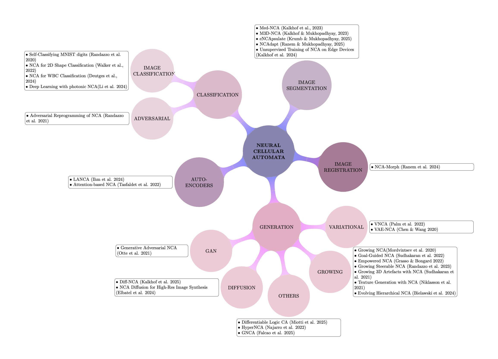

# NCA Overview
## Our project and Motivation
Neural Cellular Automata (NCA) is a very niche research field, and more often than not, researchers have never heard of them. We are participating in the MICCAI Educational Challenge 2025 to broaden access to NCA knowledge and create an entry point, making it easier to get started! To become more familiar with NCAs and gain a deeper understanding of them across different tasks, we provide minimal working implementations in notebooks of several notable NCAs:

**Notebooks**:
1. [Growing-NCA](./notebooks/1_growing.ipynb) (Mordvintsev et al. 2020) a generation task.
2. [Med-NCA](./notebooks/2_segmentation.ipynb) (Kalkhof et al. 2023), a segmentation task.
3. [WBC classification NCA](./notebooks/3_classification.ipynb) (Deutges et al. 2024), a classification task.

This repository will not only provide minimial working examples of NCA on practical tasks, but we also provide an organized overview of established NCAs in general. We do hope to encourage readers to explore the fascinating field of NCAs!

Below, you'll find:
- A brief Introduction to NCA.
- An overview of prominent NCA papers which shaped this research direction in form of a mindmap.
- Links to our references for further study. 

## Neural Cellular Automata: What are they?
Neural Cellular Automata (from now on referred to as NCA) are a fascinating class of architecture. By combining traditional cellular automata with flexible neural networks, they enable the simulation of self organizing systems. Unlike classical cellular automata, defined by hand-crafted rules (such as in Conway's Game of Life for example), NCAs learn their update rules via gradients and optimization. 

NCAs generally excel in scenarios where memory efficiency is valued as well as robustness. Naturally, NCAs can handle a wide range of tasks, with notable strengths in image segmentation, generation, and classification. Based on [Awesome NCA](https://github.com/MECLabTUDA/awesome-nca), a repository that provides a curated list of NCA related research, we have created this mindmap as an overview of the different tasks NCAs provide.

## NCA tasks: An Overview
As previously said, NCAs can tackle a broad number of tasks. Since NCAs can be applied in a variety of scenarios, we attempted to organize them into 5 general tasks:
1. **Generation**: NCAs grow patterns, textures or shapes from seeds.
2. **Image Segmentation**: Using NCAs local updates to our advantage and producing accuate segmentation masks.
3. **Classification**: NCAs grow to recognize patterns or classify input data.
4. **Image Registration**: Aligning images through refinement.
5. **Autoencoders**: Compress and reconstruct data using NCA dynamics.

## Resources and further reading:
For further reading please check out the [Awesome NCA repository](https://github.com/MECLabTUDA/awesome-nca)!
### **Generation**:
1. Variational:
    - [VNCA](https://arxiv.org/pdf/2201.12360), Palm et al. 2022
    - [VAE-NCA](https://arxiv.org/abs/2010.04949), Chen & Wang 2020   
2. Growing:
    - [Growing NCA](https://distill.pub/2020/growing-ca/), Mordvintsev et al. 2020
    - [Goal-Guided NCA](https://arxiv.org/pdf/2205.06806), Sudhakaran et al. 2022
    - [Empowered NCA](https://arxiv.org/pdf/2205.06771), Grasso & Bongard 2022
    - [Growing Steerable NCA](https://arxiv.org/abs/2302.10197), Randazzo et al. 2023
    - [Growing 3D Artefacts with NCA](https://arxiv.org/abs/2103.08737), Sudhakaran et al. 2021
    - [Texture Generation with NCA](https://distill.pub/selforg/2021/textures/), Niklasson et al. 2021
    - [Evolving Hierarchical NCA](https://dl.acm.org/doi/pdf/10.1145/3638529.3654150), Bielawski et al. 2024
3. Diffusion:
    - [Diff-NCA](https://www.nature.com/articles/s44335-025-00026-4), Kalkhof et al. 2025
    - [NCA Diffusion for High-Res Image Synthesis](https://arxiv.org/pdf/2407.03018), Elbatel et al. 2024
4. GAN:
    - [Generative Adversarial NCA](https://arxiv.org/abs/2108.04328), Otte et al. 2021
5. OTHERS:
    - [Differentiable Logic CA](https://google-research.github.io/self-organising-systems/difflogic-ca/), Miotti et al. 2025
    - [HyperNCA](https://arxiv.org/pdf/2204.11674), Najarro et al. 2022
    - [GNCA](https://openreview.net/pdf?id=gIrVoQEDQv), Falcao et al. 2025
### **Classification**:
1. Image Classification:
    - [Self-Classifying MNIST digits](https://distill.pub/2020/selforg/mnist/), Randazzo et al. 2020
    - [NCA for 2D Shape Classification](https://ieeexplore.ieee.org/stamp/stamp.jsp?arnumber=9981214), Walker et al. 2022
    - [NCA for WBC Classification](https://arxiv.org/abs/2404.05584), Deutges et al. 2024
    - [Deep Learning with photonic NCA](https://www.nature.com/articles/s41377-024-01651-7), Li et al. 2024
2. Adversarial:
    - [Adversarial Reprogramming of NCA](https://distill.pub/selforg/2021/adversarial/), Randazzo et al. 2021
### **Autoencoders**:
- [LANCA](https://link.springer.com/chapter/10.1007/978-3-031-78186-5_25), Ihm et al. 2024
- [Attention-based NCA](https://proceedings.neurips.cc/paper_files/paper/2022/file/361e5112d2eca09513bbd266e4b2d2be-Paper-Conference.pdf), Tesfaldet et al. 2022
### **Image Segmentation**:
- [Med-NCA](https://arxiv.org/abs/2302.03473), Kalkhof et al. 2023
- [M3D-NCA](https://arxiv.org/pdf/2309.02954), Kalkhof & Mukhopadhyay 2023
- [eNCApsulate](https://arxiv.org/pdf/2504.21562), Krumb & Mukhopadhyay 2025
- [NCAdapt](https://arxiv.org/abs/2410.23368), Ranem & Mukhopadhyay 2025
- [Unsupervised Training of NCA on Edge Devices](https://arxiv.org/pdf/2407.18114), Kalkhof et al. 2024
### **Image Registration**:
- [NCA-Morph](https://arxiv.org/pdf/2410.22265), Ranem et al. 2024
